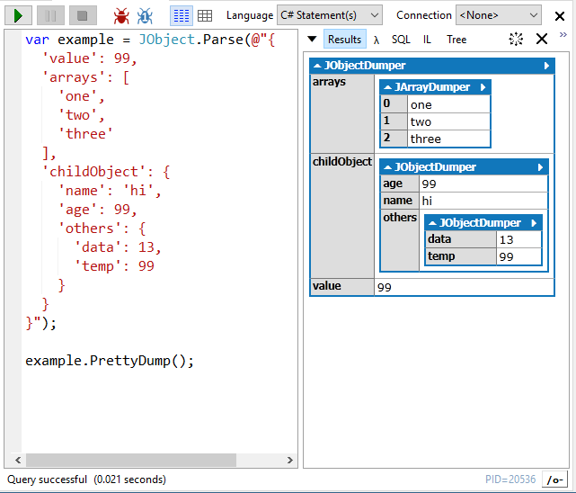

# JToken.PrettyDump() for LINQPad!

JToken.PrettyDump() for LinqPad

> ## Obsolete as of v5.40

> **Note**: LINQPad v5.40 added native support for Newtonsoft.Json, and thus this library is no longer needed.

## NuGet

[](https://www.nuget.org/packages/PrettyDump.LINQPad.Newtonsoft.Json)

```
PM> Install-Package PrettyDump.LINQPad.Newtonsoft.Json
```


## Quick Summary

Adds an extension method to `JToken` called `PrettyDump()`,  that when called from [LINQPad](https://www.linqpad.net/), will dump the JSON representation to the Output window as if it was a .NET object:



